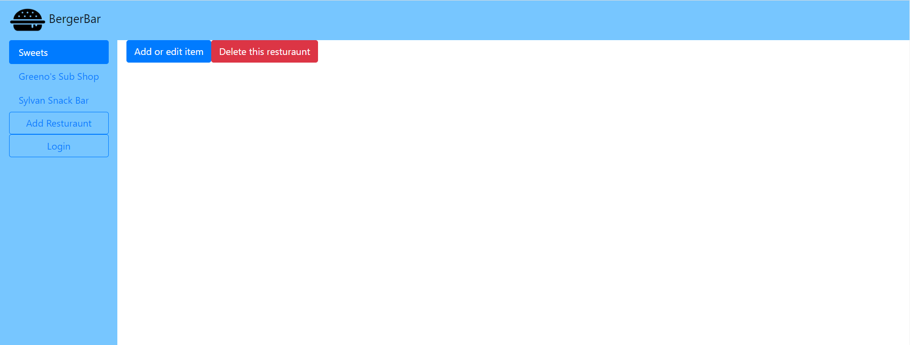
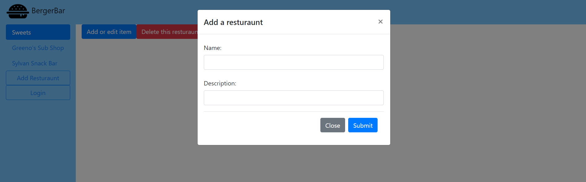
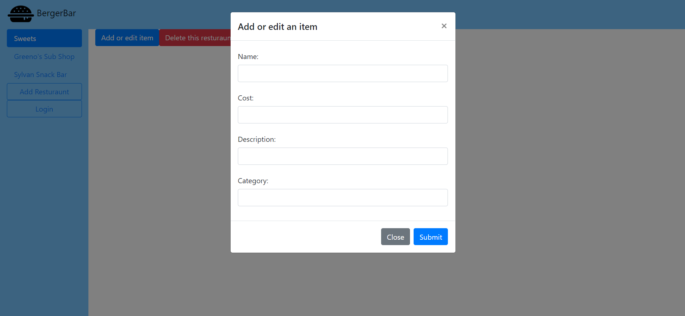
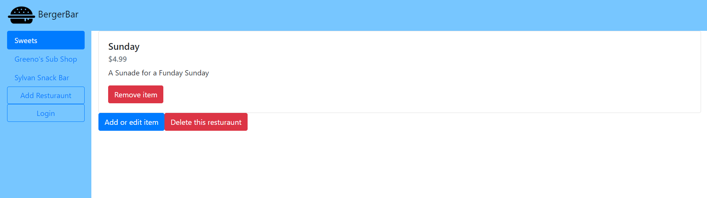

# Team: Gimel

## App Name: BergerBar

### Semester: Spring 2020

### Overview:

Our application is a plateform where students can easily access the menues of different students own businesses. It's easy to use for staff as well as students. Our application is innovative becasue we have all of the small business in one app rather than different app for every small business. 

### Team Members:

* Veronica Gusev: dergoose
* Sayed Shah: sayedkhalidshah2
* Joshua Read: Joshua9991

### User Interface:
Home Page:

The UI of the home page allows you to work with the restaurants and items of the those restaurant by clikcing on it on the sidebar. By clicking "Add Restaurant", it brings up the restaurant adding form that allows you to put in the information specified, such as name and descriptions:

From the page of a resturant you can also add items to that pages restaurant menu by clicking the "Add or edit item" button which will bring up another field of values in order to describe the item that will be added
(Note: The "delete this resturant" button will in fact remove that restaurant and all it's items from the side and remove it from the side bar)

(Note: If the Name attribute has the name of an already existing item then a new item will not be made, and instead the item's information will be updated according to the information specified)

Once there are menu items, that restaurants page will be updated to show all the items on that pages menu and can then be interacted with by using the "delete" button to remove the item and the page will be updated once again.

### APIs:

<span style="text-decoration:underline;">GET /menus</span>

Gives back a list of restaurants that are in BergerBar

<span style="text-decoration:underline;">Request</span>


<table>
  <tr>
   <td><strong>Parameter</strong>
   </td>
   <td><strong>Description</strong>
   </td>
   <td><strong>Example</strong>
   </td>
  </tr>
  <tr>
   <td>N/A
   </td>
   <td>N/A
   </td>
   <td>localhost:8080/menu
   </td>
  </tr>
</table>


<span style="text-decoration:underline;">Response</span>


<table>
  <tr>
   <td><strong>Key   </strong>
   </td>
   <td><strong>Value Type</strong>
   </td>
   <td><strong>Description</strong>
   </td>
  </tr>
  <tr>
   <td>menus
   </td>
   <td>array of strings 
   </td>
   <td>The list of menus BergerBar has
   </td>
  </tr>
</table>


<span style="text-decoration:underline;">POST menus</span>

Onboards a new restaurant

<span style="text-decoration:underline;">Request</span>


<table>
  <tr>
   <td><strong>Parameter</strong>
   </td>
   <td><strong>Description</strong>
   </td>
   <td><strong>Example</strong>
   </td>
  </tr>
  <tr>
   <td>name
   </td>
   <td>(Required) The desired name of the restaurant
   </td>
   <td>localhost:8080/menus/
<p>
{“name” : “greenos”, 
<p>
“dscr” : “We are a sandwich shop in Orchard Hill” }
   </td>
  </tr>
  <tr>
   <td>dscr
   </td>
   <td>(Required) The desired description of the restaurant
   </td>
   <td>
   </td>
  </tr>
</table>


<span style="text-decoration:underline;">Response</span>


<table>
  <tr>
   <td><strong>Key</strong>
   </td>
   <td><strong>Value Type</strong>
   </td>
   <td><strong>Description</strong>
   </td>
  </tr>
  <tr>
   <td>name
   </td>
   <td>string
   </td>
   <td>The new name of the restaurant
   </td>
  </tr>
  <tr>
   <td>dscr
   </td>
   <td>double
   </td>
   <td>The new value of the restaurant
   </td>
  </tr>
</table>


<span style="text-decoration:underline;">GET menus/{rest}</span>

Gives back a list of items from a restaurant

<span style="text-decoration:underline;">Request</span>


<table>
  <tr>
   <td><strong>Parameter</strong>
   </td>
   <td><strong>Description</strong>
   </td>
   <td><strong>Example</strong>
   </td>
  </tr>
  <tr>
   <td>rest
   </td>
   <td>(Required) The name of restaurant
   </td>
   <td>localhost:8080/menu/greenos
   </td>
  </tr>
</table>


<span style="text-decoration:underline;">Response</span>


<table>
  <tr>
   <td><strong>Key</strong>
   </td>
   <td><strong>Value Type</strong>
   </td>
   <td><strong>Description</strong>
   </td>
  </tr>
  <tr>
   <td>items
   </td>
   <td>array of item objects
   </td>
   <td>The list of items a restaurant has
   </td>
  </tr>
</table>


<span style="text-decoration:underline;">DELETE menus/{rest}</span>

Removes a restaurant

<span style="text-decoration:underline;">Request</span>


<table>
  <tr>
   <td><strong>Parameter</strong>
   </td>
   <td><strong>Description</strong>
   </td>
   <td><strong>Example</strong>
   </td>
  </tr>
  <tr>
   <td>rest
   </td>
   <td>(Required) The restaurant the menu item belongs to
   </td>
   <td>localhost:8080/menu/greenos
   </td>
  </tr>
</table>


<span style="text-decoration:underline;">Response</span>


<table>
  <tr>
   <td><strong>Key</strong>
   </td>
   <td><strong>Value Type</strong>
   </td>
   <td><strong>Description</strong>
   </td>
  </tr>
  <tr>
   <td>name
   </td>
   <td>string
   </td>
   <td>The deleted name of the menu item 
   </td>
  </tr>
  <tr>
   <td>dscr
   </td>
   <td>string
   </td>
   <td>The deleted description of the menu item 
   </td>
  </tr>
</table>


<span style="text-decoration:underline;">GET menus/{rest}/{item}</span>

Gives back a single item from a restaurant (eg. Gutbuster)

<span style="text-decoration:underline;">Request</span>

There are two required parameters and zero optional parameters for this endpoint.


<table>
  <tr>
   <td><strong>Parameter</strong>
   </td>
   <td><strong>Description</strong>
   </td>
   <td><strong>Example</strong>
   </td>
  </tr>
  <tr>
   <td>rest
   </td>
   <td>(Required) The name of the restaurant
   </td>
   <td>localhost:8080/menus/greenos/gutbuster
   </td>
  </tr>
  <tr>
   <td>item
   </td>
   <td>(Required) The name of the menu item
   </td>
   <td>
   </td>
  </tr>
</table>


<span style="text-decoration:underline;">Response</span>

All response data is returned as a JSON object


<table>
  <tr>
   <td><strong>Key</strong>
   </td>
   <td><strong>Value Type</strong>
   </td>
   <td><strong>Description</strong>
   </td>
  </tr>
  <tr>
   <td>name
   </td>
   <td>string
   </td>
   <td>The name of the menu item 
   </td>
  </tr>
  <tr>
   <td>cost
   </td>
   <td>double
   </td>
   <td>The value of the menu item 
   </td>
  </tr>
  <tr>
   <td>dscr
   </td>
   <td>string
   </td>
   <td>The description of the menu item 
   </td>
  </tr>
  <tr>
   <td>rest
   </td>
   <td>string
   </td>
   <td>The restaurant of the menu item 
   </td>
  </tr>
  <tr>
   <td>type
   </td>
   <td>string
   </td>
   <td>The categorization of the menu item 
   </td>
  </tr>
</table>


<span style="text-decoration:underline;">POST menus/{rest}</span>

Adds an item to a restaurant

<span style="text-decoration:underline;">Request</span>

There are two required parameters and zero optional parameters for this endpoint.


<table>
  <tr>
   <td><strong>Parameter</strong>
   </td>
   <td><strong>Description</strong>
   </td>
   <td><strong>Example</strong>
   </td>
  </tr>
  <tr>
   <td>rest
   </td>
   <td>(Required) The name of the restaurant
   </td>
   <td>localhost:8080/menu/greenos/
<p>
{“name” : “bagel” 
<p>
“cost” : “5”,
<p>
“dscr” : “Whole wheat bagel, toasted”, 
<p>
“type” : “sandwich”}
   </td>
  </tr>
  <tr>
   <td>item
   </td>
   <td>(Required) The name of the menu item
   </td>
   <td>
   </td>
  </tr>
</table>


<span style="text-decoration:underline;">Response</span>

All response data is returned as a JSON object


<table>
  <tr>
   <td><strong>Key</strong>
   </td>
   <td><strong>Value Type</strong>
   </td>
   <td><strong>Description</strong>
   </td>
  </tr>
  <tr>
   <td>name
   </td>
   <td>string
   </td>
   <td>The name of the menu item 
   </td>
  </tr>
  <tr>
   <td>cost
   </td>
   <td>double
   </td>
   <td>The value of the menu item 
   </td>
  </tr>
  <tr>
   <td>dscr
   </td>
   <td>string
   </td>
   <td>The description of the menu item “c
   </td>
  </tr>
  <tr>
   <td>type
   </td>
   <td>string
   </td>
   <td>The categorization of the menu item 
   </td>
  </tr>
</table>


<span style="text-decoration:underline;">DELETE menus/{rest}/{item}</span>

Deletes an item from a restaurant

<span style="text-decoration:underline;">Request</span>

There are two required parameters and zero optional parameters for this endpoint.


<table>
  <tr>
   <td><strong>Parameter</strong>
   </td>
   <td><strong>Description</strong>
   </td>
   <td><strong>Example</strong>
   </td>
  </tr>
  <tr>
   <td>rest
   </td>
   <td>(Required) The name of the restaurant
   </td>
   <td>localhost:8080/menu/greenos/gutbuster
   </td>
  </tr>
  <tr>
   <td>item
   </td>
   <td>(Required) The name of the menu item
   </td>
   <td>
   </td>
  </tr>
</table>


<span style="text-decoration:underline;">Response</span>

All response data is returned as a JSON object


<table>
  <tr>
   <td><strong>Key</strong>
   </td>
   <td><strong>Value Type</strong>
   </td>
   <td><strong>Description</strong>
   </td>
  </tr>
  <tr>
   <td>name
   </td>
   <td>string
   </td>
   <td>The name of the menu item 
   </td>
  </tr>
  <tr>
   <td>cost
   </td>
   <td>double
   </td>
   <td>The value of the menu item 
   </td>
  </tr>
  <tr>
   <td>dscr
   </td>
   <td>string
   </td>
   <td>The description of the menu item 
   </td>
  </tr>
  <tr>
   <td>rest
   </td>
   <td>string
   </td>
   <td>The restaurant of the menu item 
   </td>
  </tr>
  <tr>
   <td>type
   </td>
   <td>string
   </td>
   <td>The categorization of the menu item 
   </td>
  </tr>
</table>


### Database:

Database Documentation
```
Collection : "sylvan" { //The name of the collection, in this case it is the name of the restaurant
  menu: [ //The array of menu items
    {
      name: "CBR Calzone", //The name of the menu item
      cost: "15.99", //The cost of the menu item
      rest: "sylvan", //The name of the restaurant
      group: "calzones", //The resturant food group the item belongs to
      descr: "A calzone with chicken,bacon and ranch, served with optional marinara sauce" //The description of the food item
    },
    {
      name: "Arizona", 
      cost: "0.99",
      rest: "sylvan",
      group: "beverages", 
      descr: "Crisp and refreshing beverage for cheap"
    }
    ...
  ]
}

```


### URL Routes/Mappings:

* /
..* Route to Home page
* /menus
..* Gives back a list of restaurants that are in BergerBar
..* Onboards a new restaurant

* /menus/{rest}
..* Gives back a list of items from a restaurant
..* Removes a restaurant

* /menus/{rest}/{item}
..* Gives back a single item from a restaurant (eg. Gutbuster)
..* Adds an item to a restaurant
..* Deletes an item from a restaurant
..* Updates an item to a restaurant

### Aunthentication:
...

### Division of Labor:
Sayed: Worked on frontend refinement and documentation, contributions also in routing and database edits

Veronica: Worked on database and front end refinement as well as server debugging, contributions also in routing

Josh: Worked on routing and frontend refinement, contributions also in database edits

### Conclusion:

We all have enjoyed working on this project. We learned how front-end interacts with the server and how the server interacts with the database. One of the important lesson was learning the CRUD operations through different class activities. We were able to use them and integrate them in our project. 

The most difficult part was coming up with different ideas of what we would like our project to be. Then the design was also a dificulty becasue we were sure how our final product would look like. The milestones were organized very nicely and help us throughout all of the steps. We came up with mockups that gave us a head start. We also went into some difficulites of making the CRUD operations to work properly with the front-end as well as with the database. 

We would have like to learn more about authentication during the inclass exercises. It is a helpfull skill and would have made the authentication process for us. Otherthan that we were on the top of every milestone and did more work than the required work that made our final milestone more enjoyable to work at. 

While deploying our app on Heroku, we went to minor difficulties but then the TA had us help to overcome that obsticle. 


