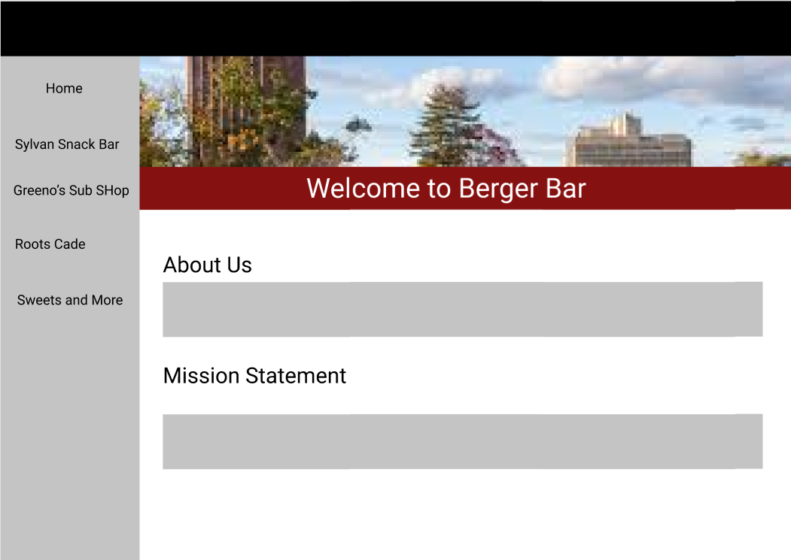
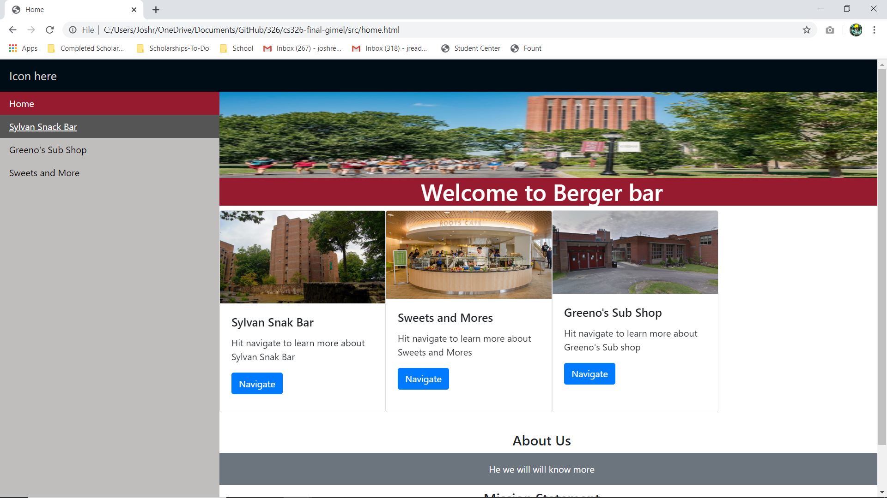
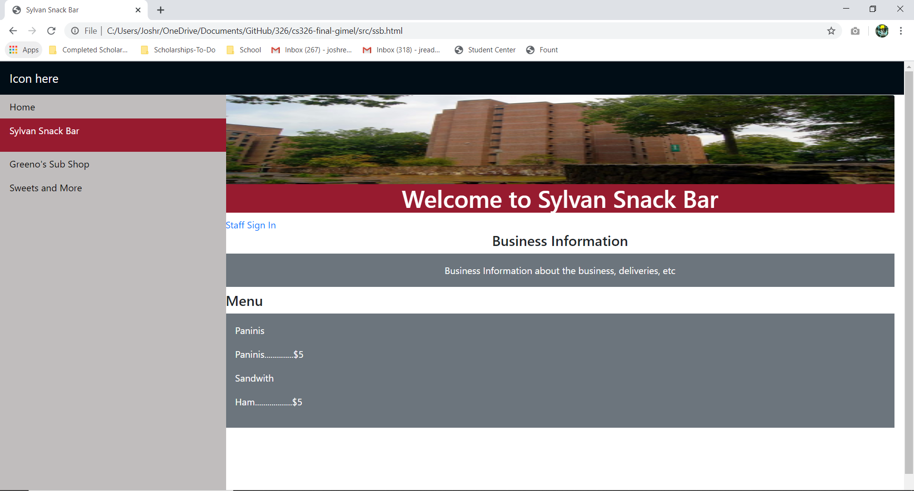
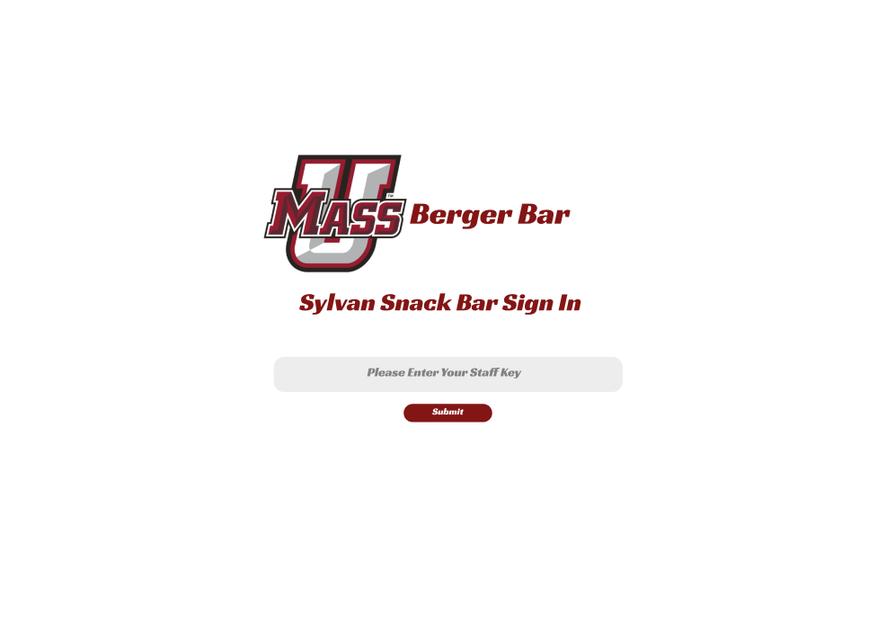
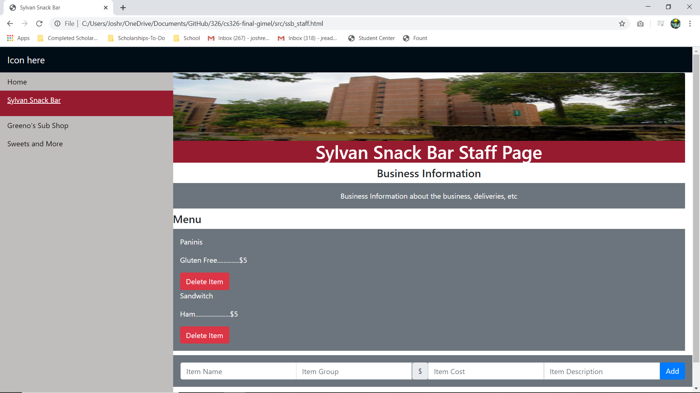

Innovative Idea
---
Our idea is to create a centralized site such that both the students and staff who go to student run buisness or Blue Wall have an easy and efficient way to see full menus, operating times, contact information, etc. The idea came from the lack of any truly convenient sites for student run buisnesses like the ones that exist for the Dining Halls. We are basing the idea of final project off of the current [UMass Dining](https://umassdining.com/) website that many students use in order to know what meals are going to be offered at the dining hall of their choosing. While the students have an easy way to "see" the buisnesses dining information (such as Roots, Sylvan Snack Bar, Greenos and the rest), the students who work in the buisness will have an easy way to edit the information in real time for customers to see. If there is any doubt of how poorly maintained UMass's dining menus are, here's an example: https://umassdining.com/menu/um-bakery-blue-wall-menu.

 Important Components:
Functions provided by the application will be as follows: user authentification in order to distinguish between staff and customer and the ability for staff to alter menu components (eg. menu items, descriptions, prices), hours of operation, contact information and important notices or messages for customers. We will make the interface user friendly so that these features will be easily accesible for the staff in order for them to efficiently alter the site without any kind of web development experience. This is important because we want to make it quick and easy for staff, who are probably not computer scientists, to be able to alter a webpage. This also means that there will exist a "log in/log out" functionality for the staff to use, only staff will have the credentials needed for this function. There will be a way for staff to onboard (or offboard) their business. 

 Home Screen:
---
The home screen brings the user to the main page where they can nagivate to the Student Run Buisness of their choice. It also has information about the website itself and its mission statement so it appears more professional to the students and staff who will be using it

Mockup Page:

HTML Page:

Buisness Customer Page:
---
The Buisness Customer page is where users can see the available information about the buisness such as its standard buisness information such as hours of operation and numbers. They can also see the buisnesses menu for items,descriptions and prices. From this page they can also navigate to the home page or any other restuarants page or if they are staff members of that buisness can use the "sign in" link to get to that buisnesses Sign In page.

Mockup Page:

HTML Page:

Sign In Page:
---
The Sign In page allows the staff of the given restuarant to use their issued key code in orer to get to the Buisness Staff Page for their given buisness. All the staff will get their own individuals code that only allows them to alter their own buinsesse's page and no others

Mockup Page:

HTML Page:

Buisness Staff Page:
---
The Buisness Staff page is where users who are staff of a given buisness can edit their buisness information by removing and adding items to the menu's with the appropriate information and changing the buisnesses general information. When they go back to the regular site the information there will be updated according to the changes made by the staff.

Mockup Page:

HTML Page:
