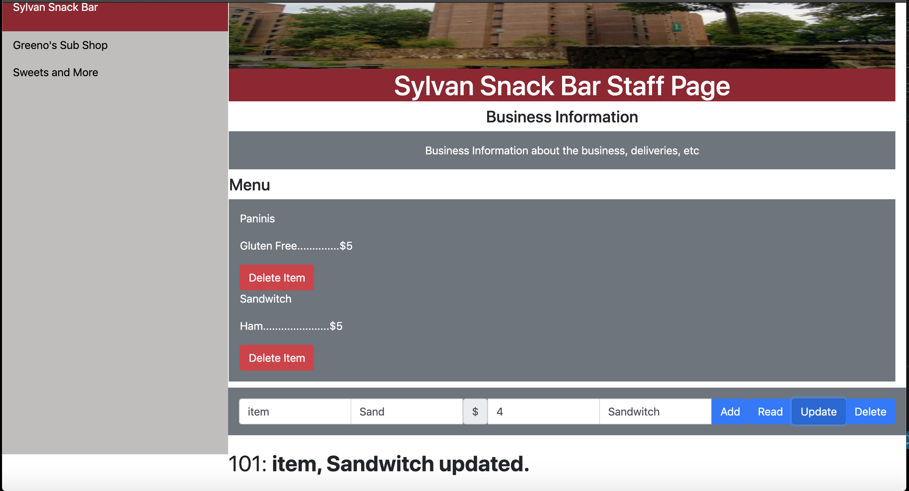
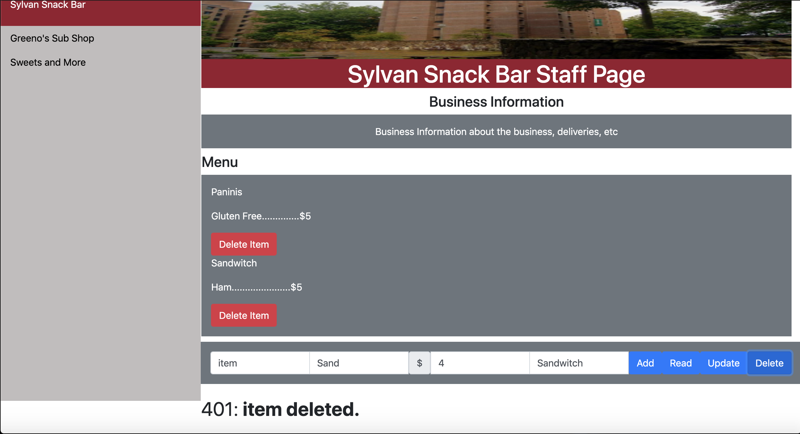

Heroku Application Link:

https://gimel-final.herokuapp.com/

API Documentation

GET api/menus

Gives back a list of restaurants that are in BergerBar

Request

<table>
  <tr>
   <td><strong>Parameter</strong>
   </td>
   <td><strong>Description</strong>
   </td>
   <td><strong>Example</strong>
   </td>
  </tr>
  <tr>
   <td>N/A
   </td>
   <td>N/A
   </td>
   <td>localhost:8080/api/menu
   </td>
  </tr>
</table>

Response

<table>
  <tr>
   <td><strong>Key   </strong>
   </td>
   <td><strong>Value Type</strong>
   </td>
   <td><strong>Description</strong>
   </td>
  </tr>
  <tr>
   <td>menus
   </td>
   <td>array of strings 
   </td>
   <td>The list of menus BergerBar has
   </td>
  </tr>
</table>

POST api/menus

Onboards a new restaurant

Request

<table>
  <tr>
   <td><strong>Parameter</strong>
   </td>
   <td><strong>Description</strong>
   </td>
   <td><strong>Example</strong>
   </td>
  </tr>
  <tr>
   <td>name
   </td>
   <td>(Required) The desired name of the restaurant
   </td>
   <td>localhost:8080/api/menus/

{“name” : “greenos”, 

“dscr” : “We are a sandwich shop in Orchard Hill” }
   </td>
  </tr>
  <tr>
   <td>dscr
   </td>
   <td>(Required) The desired description of the restaurant
   </td>
   <td>
   </td>
  </tr>
</table>

Response

<table>
  <tr>
   <td><strong>Key</strong>
   </td>
   <td><strong>Value Type</strong>
   </td>
   <td><strong>Description</strong>
   </td>
  </tr>
  <tr>
   <td>name
   </td>
   <td>string
   </td>
   <td>The new name of the restaurant
   </td>
  </tr>
  <tr>
   <td>dscr
   </td>
   <td>double
   </td>
   <td>The new value of the restaurant
   </td>
  </tr>
</table>

GET api/menus/{rest}

Gives back a list of items from a restaurant

Request

<table>
  <tr>
   <td><strong>Parameter</strong>
   </td>
   <td><strong>Description</strong>
   </td>
   <td><strong>Example</strong>
   </td>
  </tr>
  <tr>
   <td>rest
   </td>
   <td>(Required) The name of restaurant
   </td>
   <td>localhost:8080/api/menu/greenos
   </td>
  </tr>
</table>

Response

<table>
  <tr>
   <td><strong>Key</strong>
   </td>
   <td><strong>Value Type</strong>
   </td>
   <td><strong>Description</strong>
   </td>
  </tr>
  <tr>
   <td>items
   </td>
   <td>array of item objects
   </td>
   <td>The list of items a restaurant has
   </td>
  </tr>
</table>

DELETE api/menus/{rest}

Removes a restaurant

Request

<table>
  <tr>
   <td><strong>Parameter</strong>
   </td>
   <td><strong>Description</strong>
   </td>
   <td><strong>Example</strong>
   </td>
  </tr>
  <tr>
   <td>rest
   </td>
   <td>(Required) The restaurant the menu item belongs to
   </td>
   <td>localhost:8080/api/menu/greenos
   </td>
  </tr>
</table>

Response

<table>
  <tr>
   <td><strong>Key</strong>
   </td>
   <td><strong>Value Type</strong>
   </td>
   <td><strong>Description</strong>
   </td>
  </tr>
  <tr>
   <td>name
   </td>
   <td>string
   </td>
   <td>The deleted name of the menu item 
   </td>
  </tr>
  <tr>
   <td>dscr
   </td>
   <td>string
   </td>
   <td>The deleted description of the menu item 
   </td>
  </tr>
</table>

GET api/menus/{rest}/{item}

Gives back a single item from a restaurant (eg. Gutbuster)

Request

There are two required parameters and zero optional parameters for this endpoint.

<table>
  <tr>
   <td><strong>Parameter</strong>
   </td>
   <td><strong>Description</strong>
   </td>
   <td><strong>Example</strong>
   </td>
  </tr>
  <tr>
   <td>rest
   </td>
   <td>(Required) The name of the restaurant
   </td>
   <td>localhost:8080/api/menus/greenos/gutbuster
   </td>
  </tr>
  <tr>
   <td>item
   </td>
   <td>(Required) The name of the menu item
   </td>
   <td>
   </td>
  </tr>
</table>

Response

All response data is returned as a JSON object

<table>
  <tr>
   <td><strong>Key</strong>
   </td>
   <td><strong>Value Type</strong>
   </td>
   <td><strong>Description</strong>
   </td>
  </tr>
  <tr>
   <td>name
   </td>
   <td>string
   </td>
   <td>The name of the menu item 
   </td>
  </tr>
  <tr>
   <td>cost
   </td>
   <td>double
   </td>
   <td>The value of the menu item 
   </td>
  </tr>
  <tr>
   <td>dscr
   </td>
   <td>string
   </td>
   <td>The description of the menu item 
   </td>
  </tr>
  <tr>
   <td>rest
   </td>
   <td>string
   </td>
   <td>The restaurant of the menu item 
   </td>
  </tr>
  <tr>
   <td>type
   </td>
   <td>string
   </td>
   <td>The categorization of the menu item 
   </td>
  </tr>
</table>

POST api/menus/{rest}

Adds an item to a restaurant

Request

There are two required parameters and zero optional parameters for this endpoint.

<table>
  <tr>
   <td><strong>Parameter</strong>
   </td>
   <td><strong>Description</strong>
   </td>
   <td><strong>Example</strong>
   </td>
  </tr>
  <tr>
   <td>rest
   </td>
   <td>(Required) The name of the restaurant
   </td>
   <td>localhost:8080/api/menu/greenos/

{“name” : “bagel” 

“cost” : “5”,

“dscr” : “Whole wheat bagel, toasted”, 

“type” : “sandwich”}
   </td>
  </tr>
  <tr>
   <td>item
   </td>
   <td>(Required) The name of the menu item
   </td>
   <td>
   </td>
  </tr>
</table>

Response

All response data is returned as a JSON object

<table>
  <tr>
   <td><strong>Key</strong>
   </td>
   <td><strong>Value Type</strong>
   </td>
   <td><strong>Description</strong>
   </td>
  </tr>
  <tr>
   <td>name
   </td>
   <td>string
   </td>
   <td>The name of the menu item 
   </td>
  </tr>
  <tr>
   <td>cost
   </td>
   <td>double
   </td>
   <td>The value of the menu item 
   </td>
  </tr>
  <tr>
   <td>dscr
   </td>
   <td>string
   </td>
   <td>The description of the menu item “c
   </td>
  </tr>
  <tr>
   <td>type
   </td>
   <td>string
   </td>
   <td>The categorization of the menu item 
   </td>
  </tr>
</table>

DELETE api/menus/{rest}/{item}

Deletes an item from a restaurant

Request

There are two required parameters and zero optional parameters for this endpoint.

<table>
  <tr>
   <td><strong>Parameter</strong>
   </td>
   <td><strong>Description</strong>
   </td>
   <td><strong>Example</strong>
   </td>
  </tr>
  <tr>
   <td>rest
   </td>
   <td>(Required) The name of the restaurant
   </td>
   <td>localhost:8080/api/menu/greenos/gutbuster
   </td>
  </tr>
  <tr>
   <td>item
   </td>
   <td>(Required) The name of the menu item
   </td>
   <td>
   </td>
  </tr>
</table>

Response

All response data is returned as a JSON object

<table>
  <tr>
   <td><strong>Key</strong>
   </td>
   <td><strong>Value Type</strong>
   </td>
   <td><strong>Description</strong>
   </td>
  </tr>
  <tr>
   <td>name
   </td>
   <td>string
   </td>
   <td>The name of the menu item 
   </td>
  </tr>
  <tr>
   <td>cost
   </td>
   <td>double
   </td>
   <td>The value of the menu item 
   </td>
  </tr>
  <tr>
   <td>dscr
   </td>
   <td>string
   </td>
   <td>The description of the menu item 
   </td>
  </tr>
  <tr>
   <td>rest
   </td>
   <td>string
   </td>
   <td>The restaurant of the menu item 
   </td>
  </tr>
  <tr>
   <td>type
   </td>
   <td>string
   </td>
   <td>The categorization of the menu item 
   </td>
  </tr>
</table>

Seperation of work:

Sayed: Worked on frontend, contributions also in routing and database edits
Veronica: Worked on database, contributions also in routing
Josh: Worked on routing, contributions also in database edits

The team will be more focused on front-end next milestone so we focused more on backend this time

CRUD Operation:

The Create button adds a new item to the restaurent.

Button Create:

The read button get an item using the item name. This button also check if an item exists in the database,
Button Read:

The Update button gets and item by using the item name and overwrite it's cost value or description etc.

ButtonUpdate:

The delete button finds an item by name and delte it from the collections. 

Button Delete:
